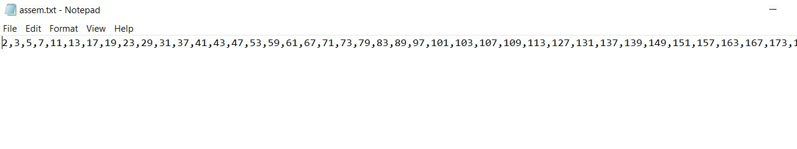

# Utilizing threads to produce Prime Numbers and print them in an output file (consume)

In this project, we are using Java threads to generate prime numbers and write them to an output file while displaying them in real-time on a GUI.

We've implemented semaphores to prevent process overlap. The producer thread generates elements in the buffer until it's full, and then the consumer thread starts consuming the elements until it's empty.

In the consumer class, I've added a delay to the execution with the line `Thread.sleep(100)` to facilitate tracking. You can modify the sleep time if needed. To make changes, refer to the following code snippet:


The user provides input, a number, and we calculate all prime numbers up to that number.

The GUI output will display on the same page, including the largest prime number generated, the total number of elements generated, and the time elapsed since the program started.


The content of the .txt files includes the list of prime numbers generated.



To get insights into what's happening in the background, check the command prompt (cmd) output, which helps explain the project.


Before executing the project, ensure that you have Java installed in your environment. You can verify this by running the following command in the command prompt:

	java --version

Then, compile and run the project with the following commands:

```
javac mainclass.java
java mainclass
```
